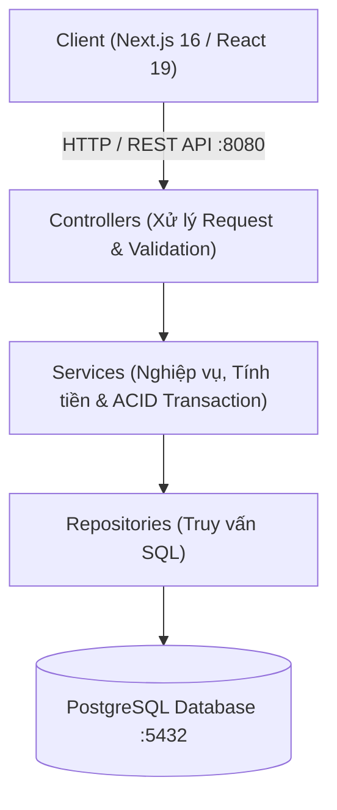

# VIMES - Hệ Thống Quản Lý Kho Dược & Vật Tư Y Tế
> Ứng dụng Quản lý Nhập Xuất Tồn kho Dược & Vật tư Y tế (Chuẩn biểu mẫu **Mẫu số 01 - VT** theo Thông tư Bộ Tài chính & Bộ Y Tế) phát triển theo phong cách thương hiệu công nghệ y tế **VIMES**.

---

## 📑 Mục lục
1. [Công nghệ sử dụng](#-công-nghệ-sử-dụng)
2. [Kiến trúc hệ thống](#-kiến-trúc-hệ-thống)
3. [Các tính năng nổi bật](#-các-tính-năng-nổi-bật)
4. [Hướng dẫn cài đặt & khởi chạy](#-hướng-dẫn-cài-đặt--khởi-chạy)
   - [Cách 1: Chạy bằng Docker Compose (Khuyên dùng)](#cách-1-chạy-bằng-docker-compose-nhanh-nhất--khuyên-dùng)
   - [Cách 2: Chạy trực tiếp trên máy (Manual)](#cách-2-chạy-thông-thường-trên-máy-local-machine)
5. [Danh sách API Endpoints](#-danh-sách-api-endpoints)
6. [Cấu trúc thư mục](#-cấu-trúc-thư-mục)

---

## 🛠️ Công nghệ sử dụng

### Frontend (`client/`)
- **Framework:** [Next.js 16 (App Router)](https://nextjs.org/) & [React 19](https://react.dev/)
- **Ngôn ngữ:** TypeScript 5
- **Styling:** Tailwind CSS v4, Modern Glassmorphism & Custom VIMES Cyan/Teal Palette
- **Icons:** Lucide React

### Backend (`service/`)
- **Runtime & Framework:** Node.js, [Express 5](https://expressjs.com/)
- **Ngôn ngữ:** TypeScript 5 (Strict mode)
- **Database:** PostgreSQL 16
- **Database Driver:** `pg` (`node-postgres` Connection Pool)
- **Validation:** Zod Schema Validation

### DevOps & Containerization
- **Docker & Docker Compose** (PostgreSQL 16 Alpine + Node.js 20 Alpine)

---

## 🏛️ Kiến trúc hệ thống

Dự án áp dụng mô hình phân lớp rõ ràng (**3-Tier Clean Layered Architecture**):



### 1. Cơ sở dữ liệu (6 bảng chuẩn hóa)
1. **`suppliers`**: Quản lý danh sách Nhà cung cấp thuốc, vật tư y tế.
2. **`departments`**: Quản lý các Khoa / Phòng ban / Đơn vị yêu cầu.
3. **`warehouses`**: Quản lý danh sách Kho bãi (Kho Chẵn, Kho Lẻ, Kho Dược, Kho Vật tư).
4. **`products`**: Quản lý danh mục Vật tư, Thuốc, Hóa chất, Nhãn hiệu, Quy cách, Phân loại, Đơn vị tính.
5. **`receipt_vouchers`**: Quản lý thông tin chung của Phiếu nhập kho (Số phiếu, Ngày lập, Người giao, TK Nợ/Có, Chứng từ gốc, Tổng tiền).
6. **`receipt_voucher_details`**: Quản lý danh sách chi tiết các mặt hàng thực nhập trong phiếu (SL Chứng từ, SL Thực nhập, Đơn giá, Thành tiền).

### 2. Đảm bảo toàn vẹn dữ liệu (ACID Transactions)
Khi lập phiếu nhập kho, toàn bộ thông tin phiếu mẹ (`receipt_vouchers`) cùng toàn bộ các dòng hàng con (`receipt_voucher_details`) được thực thi trong cùng một **PostgreSQL Transaction** (`BEGIN` ➔ `COMMIT` / `ROLLBACK`).

---

## ✨ Các tính năng nổi bật

- **📋 Lập Phiếu Nhập Kho Chuẩn Mẫu 01-VT**: Đầy đủ các trường nghiệp vụ: Số phiếu, Ngày lập, Nhà cung cấp, Đơn vị yêu cầu, Kho nhập, Người giao hàng, Tài khoản Nợ/Có (152/331), Số & ngày chứng từ gốc.
- **🔍 Custom ComboBox Searchable**: Tìm kiếm tức thì theo mã, tên, quy cách, nhãn hiệu mà không dùng thẻ `<select>` mặc định của trình duyệt.
- **⚡ Tính toán Real-time & Đọc tiền tự động**:
  - Tự động nhân `SL Thực nhập × Đơn giá = Thành tiền`.
  - Tự động cộng tổng tiền toàn phiếu.
  - Tự động dịch số tiền thành chữ tiếng Việt chuẩn kế toán (Ví dụ: *"Bốn triệu hai trăm năm mươi nghìn đồng chẵn."*).
- **📊 Trang Lịch sử & Chi tiết Phiếu Nhập (`/receipts`)**:
  - Xem danh sách toàn bộ phiếu đã nhập kho kèm bộ lọc tìm kiếm nhanh.
  - Modal xem chi tiết phiếu nhập và bảng kê danh mục vật tư.
- **🎨 Giao diện VIMES Dark Theme Sidebar**: Sidebar thu phóng mượt mà, phân nhóm menu khoa học, hiển thị trạng thái máy chủ.

---

## 🚀 Hướng dẫn cài đặt & khởi chạy

### Cách 1: Chạy bằng Docker Compose (Nhanh nhất & Khuyên dùng)

Hệ thống đã được đóng gói sẵn toàn bộ Database và Backend Service trong thư mục `service/`.

#### Bước 1: Khởi động Backend & PostgreSQL bằng Docker
Mở Terminal tại thư mục `service`:
```powershell
cd d:\tbui\test\service
docker compose up --build -d
```
> *Lệnh trên sẽ tự động dựng container PostgreSQL (cổng 5432), tự động nạp bảng & dữ liệu mẫu từ `migrations/01_init_tables.sql`, và khởi chạy Backend API tại cổng `8080`.*

- Kiểm tra trạng thái: `docker compose ps`
- Xem log backend: `docker compose logs -f service`
- Tắt hệ thống: `docker compose down`

#### Bước 2: Chạy Frontend Client
Mở Terminal mới tại thư mục `client`:
```powershell
cd d:\tbui\test\client
npm run dev
```
> Mở trình duyệt tại **`http://localhost:3000`** để sử dụng.

---

### Cách 2: Chạy thông thường trên máy (Local Machine)

#### Yêu cầu môi trường:
- Node.js >= 18.x
- PostgreSQL Server đang chạy trên cổng `5432`

#### Bước 1: Khởi tạo Database PostgreSQL
1. Tạo Database tên: `inventory_db`
2. Chạy file script SQL: [`service/migrations/01_init_tables.sql`](service/migrations/01_init_tables.sql) (bằng pgAdmin, DBeaver hoặc lệnh `psql`).

#### Bước 2: Khởi chạy Backend Service
```powershell
cd d:\tbui\test\service
npm install
npm start
```
> Backend chạy tại **`http://localhost:8080`**

#### Bước 3: Khởi chạy Frontend Client
```powershell
cd d:\tbui\test\client
npm install
npm run dev
```
> Frontend chạy tại **`http://localhost:3000`**

---

## 📡 Danh sách API Endpoints

Base URL: `http://localhost:8080/api`

| Phương thức | Endpoint | Mô tả |
| :--- | :--- | :--- |
| `GET` | `/health` | Kiểm tra trạng thái hoạt động của Backend |
| `GET` | `/api/suppliers` | Lấy danh sách Nhà cung cấp |
| `GET` | `/api/departments` | Lấy danh sách Phòng ban / Đơn vị |
| `GET` | `/api/warehouses` | Lấy danh sách Kho bãi |
| `GET` | `/api/products` | Lấy danh mục Vật tư & Dược phẩm |
| `GET` | `/api/products/:id` | Xem chi tiết 1 vật tư theo ID |
| `GET` | `/api/products/code/:code` | Tra cứu vật tư theo Mã (VD: `VT001`) |
| `GET` | `/api/receipts` | Lấy danh sách lịch sử phiếu nhập kho |
| `GET` | `/api/receipts/:id` | Lấy chi tiết phiếu nhập kho & danh sách mặt hàng |
| `POST` | `/api/receipts` | Tạo mới phiếu nhập kho (Master-Detail Transaction) |

---

## 📁 Cấu trúc thư mục

```
d:/tbui/test/
├── README.md                     # Tài liệu hướng dẫn dự án
├── .gitignore                    # Cấu hình bỏ qua file cho Git
│
├── service/                      # BACKEND SERVICE (Node.js/Express/PostgreSQL)
│   ├── Dockerfile                # Dockerfile build Backend container
│   ├── docker-compose.yml        # Compose chạy PostgreSQL & Backend
│   ├── .dockerignore
│   ├── .env                      # Biến môi trường Backend
│   ├── package.json
│   ├── tsconfig.json
│   ├── migrations/
│   │   └── 01_init_tables.sql    # DDL 6 bảng & Seed dữ liệu mẫu ban đầu
│   └── src/
│       ├── config/               # Cấu hình Pool kết nối PostgreSQL
│       ├── models/               # Định nghĩa TypeScript Interfaces & Zod Schemas
│       ├── repositories/         # Tầng thao tác cơ sở dữ liệu (Raw SQL parameterized)
│       ├── services/             # Tầng xử lý nghiệp vụ & Transaction
│       ├── controllers/          # Tầng nhận request & trả lời response
│       └── routes/               # Bộ định tuyến API
│
└── client/                       # FRONTEND CLIENT (Next.js 16/React 19/Tailwind)
    ├── .env                      # Biến môi trường Client
    ├── package.json
    ├── tsconfig.json
    └── src/
        ├── app/
        │   ├── layout.tsx        # Shell layout tổng nhúng Sidebar
        │   ├── page.tsx          # Trang Lập Phiếu Nhập Kho (Mẫu 01-VT)
        │   └── receipts/
        │       └── page.tsx      # Trang Danh Sách & Lịch Sử Phiếu Nhập
        ├── components/           # Bộ UI Components tùy biến
        │   ├── Button.tsx
        │   ├── Input.tsx
        │   ├── ComboBox.tsx      # Dropdown Searchable tùy biến
        │   ├── Sidebar.tsx       # Sidebar thu gọn mang phong cách VIMES
        │   └── MainLayout.tsx
        ├── constants/            # Quản lý đường dẫn APP_PATHS tập trung
        ├── services/             # Tầng gọi API Backend (fetch wrapper)
        ├── types/                # Types định nghĩa dữ liệu đồng bộ
        └── utils/
            └── format.ts         # Tiện ích định dạng tiền VND & dịch số thành chữ
```
